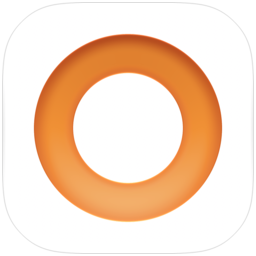
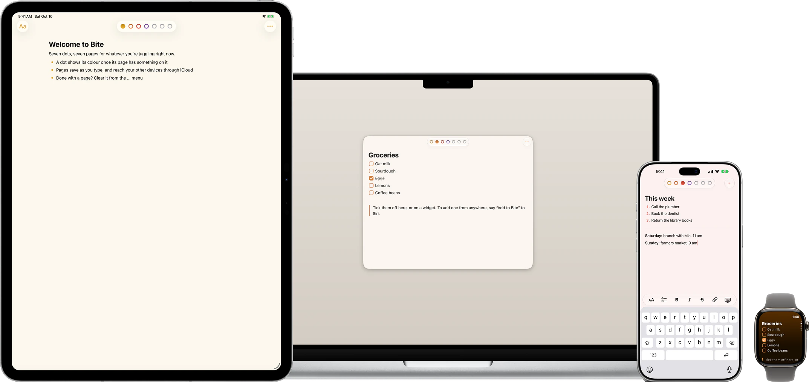
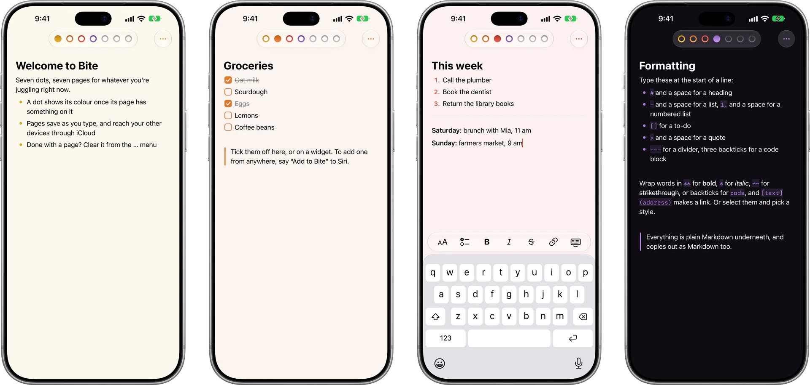
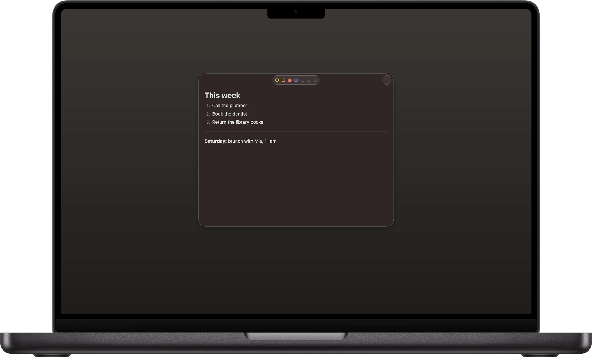
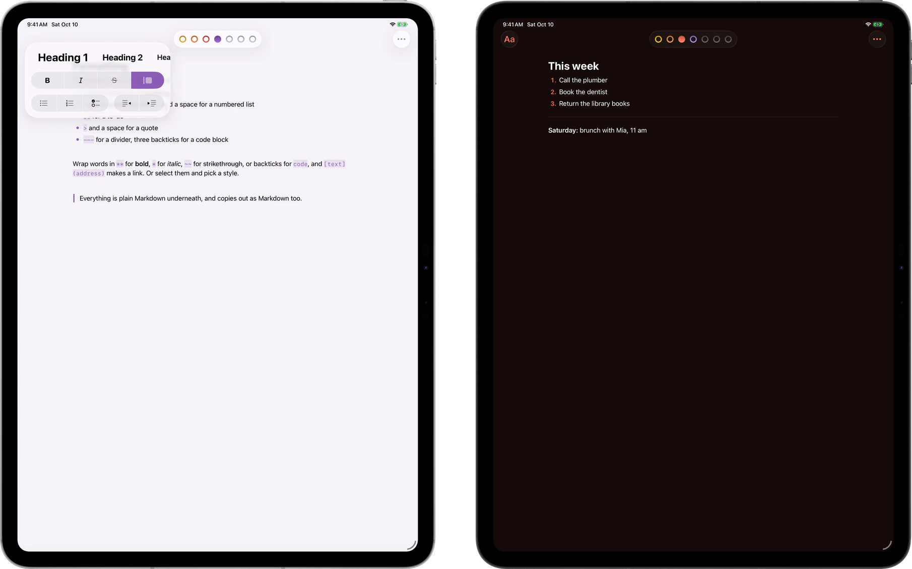
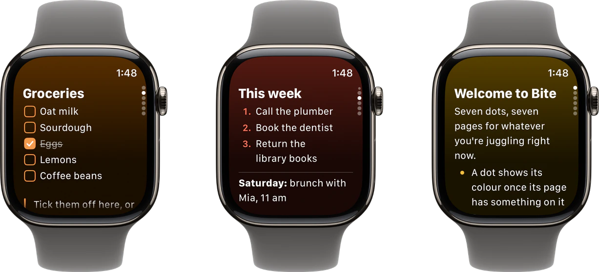
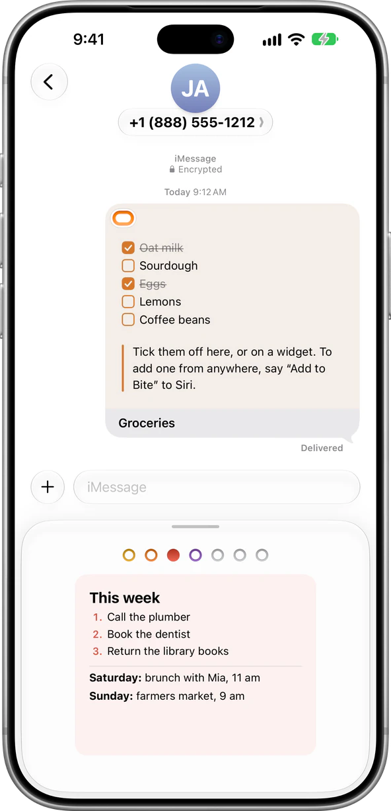
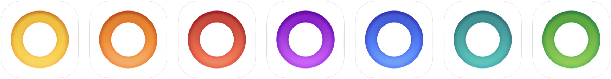

<p align="center">
  
</p>

<h1 align="center">Bite</h1>

<p align="center">
  <strong>Seven pages, always at hand.</strong><br>
  A seven-dot scratchpad for iPhone, iPad, Mac, Apple Watch and Apple Vision Pro.<br>
  Inspired by <a href="https://tot.rocks">Tot</a>, and taken further.
</p>

<p align="center">
  <a href="https://apps.apple.com/app/id6820961696"></a>
  
  
</p>

<p align="center">
  
</p>

## Seven dots. Seven pages.

Bite is one place for whatever you're juggling right now. There are seven pages, one for each coloured dot, and nothing else to manage: no folders, no files, no titles to think up. Tap a dot, or swipe, and you're on that page.

Groceries on orange, the week ahead on red, ideas on purple. Every page has its own colour, from its dot to its paper, and a dot fills in once its page has something on it, so you can see where everything is at a glance. Done with a page? Clear it from the … menu, and Undo brings it back if you change your mind.

<p align="center">
  
</p>

## Just start typing.

There's nothing to set up and nothing to save. Pick a dot and type, and the page keeps every word as you go. Bite is plain Markdown underneath, and it formats as you write:

| Type at the start of a line | and get |
| :-- | :-- |
| `#` and a space | a heading |
| `-` and a space | a bulleted list |
| `1.` and a space | a numbered list |
| `[]` | a to-do |
| `>` and a space | a quote |
| `---` | a divider |
| `` ``` `` | a code block |

Wrap words in `**` for **bold**, `*` for *italic*, `~~` for ~~strikethrough~~, or backticks for `code`, and `[text](address)` makes a link. Or select text and pick a style from the bar above the keyboard. Pages copy out as Markdown too, and links open with a tap.

## Tick it off.

Type `[]` and a to-do appears. Tick it off with a tap, on the page, on a widget or on your wrist, and it stays there, crossed out. To add one from anywhere, say “Add to Bite” to Siri.

## On all your devices.

Your pages stay in step through your own iCloud. Change a page on two devices at once and Bite keeps the changes from both, line by line, and edits from your other devices show up while you watch.

### Mac

Bite lives in the menu bar, a keyboard shortcut away. It has desktop widgets, a Share extension, a right-click menu for links and formatting, and Share as text, PDF, image or Markdown, with Save… for a file.

<p align="center">
  
</p>

### iPad

Open Bite in as many windows as you like with ⌘N, each on its own page, or the same page kept in step. The Aa button opens a format panel like the system's own, and there's a Format menu, keyboard shortcuts and ⌘F to find.

<p align="center">
  
</p>

### Apple Watch

Read your pages, tick off to-dos and add a line, right from your wrist. Complications and the Smart Stack keep a page a glance away.

<p align="center">
  
</p>

### Apple Vision Pro

Bite opens as a window in your space, with the seven dots as visionOS's own tab bar, and its widgets sit in the room around you.

## Built into the system.

- **Widgets**: one page, all seven in turn, or just the to-dos, on the Home Screen, the Lock Screen and the Mac desktop. Tick to-dos off right there.
- **Controls**: open a page from Control Center, the Lock Screen or the Action button.
- **Siri and Shortcuts**: open a page, or add a to-do with “Add to Bite”.
- **Spotlight**: every line of every page turns up in search, and opens right where it is.
- **Share**: send text or a link from any app onto any page, in a card that works just like Bite.
- **Messages**: drop a page into a conversation as a card.
- **Export**: share a page as text, PDF, an image or Markdown.
- **Quick actions**: touch and hold the icon to Keep Writing or Add To-Do.
- **Writing Tools**: proofread and rewrite with Apple Intelligence.
- **Statistics**: a page's words, characters and paragraphs, from the … menu.

<p align="center">
  
</p>

## Your Terminal. Your AI.

Bite for Mac comes with `bite`, a command line tool for your pages. Copy its one-line setup from Bite's Settings ▸ Command Line Tool into Terminal, then:

```sh
bite list                      # each page: its title, lines and last change
bite read blue -n              # a page as Markdown, its lines numbered
bite todo orange "Oat milk"    # a to-do at the end of a page
bite tick orange "Oat milk"    # and ticked off
bite search dentist            # the lines that say it, on any page
bite export purple --pdf > ideas.pdf
```

Name a page by its colour (`yellow`, `orange`, `red`, `purple`, `blue`, `teal`, `green`), its number, or `current`. Each change goes in as if it were typed on the page, and reaches your other devices through iCloud.

`bite mcp` runs it as an MCP server, so an AI app can read and write your pages too. For Claude Code:

```sh
claude mcp add --scope user bite -- \
  /Applications/Bite.app/Contents/Helpers/bite mcp
```

`bite help` shows the rest.

## Your colour.

<p align="center">
  
</p>

On iPhone and iPad, give Bite's icon the colour of any dot, in Settings.

## Private by design.

Bite collects nothing about you: no account, no ads, no analytics, no tracking. Your pages stay on your devices and in your own private iCloud, where only you can reach them. Read the [Privacy Policy](https://chenyeni.com/bite/privacy/).

## Speaks your language.

English, 简体中文, 繁體中文, 日本語 and 한국어.

## Inspired by Tot.

Bite started from a love of [Tot](https://tot.rocks), The Iconfactory's seven-dot scratchpad: seven pages, and nothing to organise. Bite keeps that idea and takes it further:

- **To-dos** you tick off on the page, on a widget or on your wrist.
- **A native app on every Apple device**, Apple Vision Pro included.
- **Deep in the system**: Liquid Glass, widgets, Controls, Siri, Spotlight, Share and Messages.
- **Open to your tools**: a command line and an MCP server, for scripts and AI.
- **Free**, with no account, no ads and no tracking.

Bite is an independent app and isn't affiliated with The Iconfactory.

## Build it yourself.

You'll need Xcode 27. Bite runs on iOS, iPadOS, macOS, watchOS and visionOS 26 or later.

1. Open `Bite.xcodeproj`.
2. In each target's Signing & Capabilities, choose your team, and use your own bundle identifiers, App Group and iCloud container.
3. Run the `Bite`, `BiteMac`, `BiteWatch` or `BiteVision` scheme.

| Target | What it is |
| :-- | :-- |
| `Bite` | iPhone and iPad |
| `BiteControls` | widgets and Controls for iPhone and iPad |
| `BiteShare`, `BiteMessages` | the Share extension and the iMessage app |
| `BiteMac`, `BiteMacWidgets`, `BiteMacShare` | the Mac app, its widgets and its Share extension |
| `BiteCLI` | `bite` and its MCP server |
| `BiteWatch`, `BiteWatchWidgets` | Apple Watch and its complications |
| `BiteVision`, `BiteVisionWidgets` | Apple Vision Pro and its widgets |
| `Shared` | the editor, shared by iPhone, iPad and Mac |
| `Packages/BiteKit` | pages, sync and the commands behind `bite` |

Tests live in `BiteTests`, `BiteMacTests`, `BiteWatchTests`, `BiteVisionUITests` and the BiteKit package.

---

<p align="center">
  <a href="https://apps.apple.com/app/id6820961696">App Store</a> · <a href="https://chenyeni.com/bite/">Website</a> · <a href="https://chenyeni.com/bite/support/">Support</a> · <a href="https://chenyeni.com/bite/privacy/">Privacy</a>
</p>
